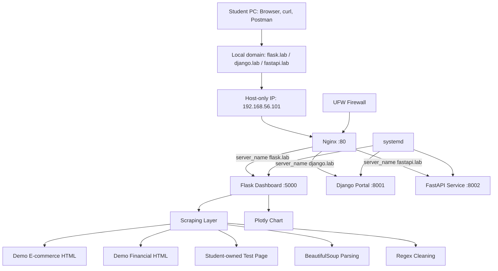

# Лабораторный проект №1
# Linux Web Server, Nginx Administration, Python Web Apps и Scraping Dashboard

> **Курс:** Сетевые системы и приложения  
> **Формат:** командный учебный проект  
> **Команда:** 1–3 студента  
> **Срок сдачи:** 7 дней с момента выдачи проекта  
> **Защита:** демонстрация проекта на ПК студентов перед преподавателем  
> **Целевая среда:** Ubuntu Server 24.04 LTS в Oracle VirtualBox  

---

## 1. Назначение проекта

В этом проекте вы превращаете Ubuntu Server в учебный web-сервер, похожий на небольшой production-сервер.

Проект объединяет:

- Linux server administration;
- Nginx web server administration;
- Python web development;
- Flask dashboard;
- Django web application;
- FastAPI API service;
- systemd deployment;
- UFW firewall;
- web scraping;
- data parsing;
- Plotly visualization;
- debugging and presentation.

Главная цель — не просто выполнить команды, а понять, как работает современный Linux web-server и как мыслит web-server administrator.

---

## 2. Связь с предыдущей лабораторной работой


Этот проект начинается с уже готовой Ubuntu Server VM. Повторять всю установку не нужно. Нужно проверить, что сервер доступен:

```bash
ssh student@192.168.56.101
```

---

## 3. Итоговый результат

К концу проекта должны работать:

| Адрес | Назначение |
|---|---|
| `http://flask.lab` | Flask dashboard со scraping-данными и Plotly-графиком |
| `http://django.lab` | Django portal с данными студента/команды |
| `http://fastapi.lab` | FastAPI web/API service |
| `http://fastapi.lab/docs` | Swagger/OpenAPI documentation |
| `http://fastapi.lab/api/student` | JSON API с данными студента/команды |

---

## 4. Архитектура проекта



---

## 5. Главная идея web-запроса

Когда пользователь открывает:

```text
http://flask.lab
```

происходит цепочка:

```text
1. Browser ищет IP для flask.lab.
2. Windows hosts file возвращает 192.168.56.101.
3. Browser отправляет HTTP request на сервер.
4. Nginx принимает request на порту 80.
5. Nginx смотрит server_name.
6. Nginx отправляет request во Flask на 127.0.0.1:5000.
7. Flask создаёт HTML response.
8. Nginx возвращает response браузеру.
```

Самая важная мысль:

> Браузер не знает, что внутри работает Flask, Django или FastAPI. Браузер видит только HTTP response.

---

## 6. Практический минимум знаний, который даёт максимум пользы

| Тема | Что нужно понять |
|---|---|
| Linux | Сервер — это файлы, права, процессы, порты, пользователи и логи |
| SSH | Безопасный удалённый вход на сервер |
| IP/DNS | Имя сайта должно прийти к IP-адресу |
| HTTP | Любой сайт — это request и response |
| Nginx | Входная точка, web server и reverse proxy |
| Ports | Каждый сервис слушает свой порт |
| systemd | Управляет приложениями как сервисами |
| UFW | Открывает только нужные входы |
| venv | Изолирует зависимости Python-приложений |
| requirements.txt | Делает окружение воспроизводимым |
| Flask | Быстрый dashboard и small web app |
| Django | Более крупное web-приложение с архитектурой |
| FastAPI | Современный API и документация |
| Scraping | HTML превращается в данные |
| Logs | Ошибки нужно читать, а не угадывать |
| curl | Быстрая проверка HTTP без браузера |
| Postman | Удобная проверка API |

---

## 7. Как должен мыслить Linux web-server administrator

При ошибке не начинайте сразу менять код. Сначала определите слой проблемы:

```text
Network
  ↓
Firewall
  ↓
Nginx
  ↓
systemd service
  ↓
Python application
  ↓
Application code
  ↓
Data / HTML / JSON
```

Главный вопрос:

```text
Где сейчас остановился request?
```

---

## 8. Требования к команде и защите

### Команда

- Проект выполняется индивидуально или командой до 3 студентов.
- Каждый участник должен понимать архитектуру проекта.
- На защите преподаватель может задавать вопросы любому участнику команды.

### Срок сдачи

- Срок сдачи: 7 дней с момента выдачи проекта.
- Команда самостоятельно распределяет задачи внутри проекта.

### Защита

На защите команда должна показать:

1. Работающие сайты.
2. Работающие API endpoints.
3. systemd-сервисы.
4. Nginx virtual hosts.
5. UFW firewall.
6. Логи.
7. Диагностику типовой ошибки.
8. Объяснение request flow от браузера до приложения.

---

## 9. Целевая среда

| Компонент | Значение |
|---|---|
| Virtualization | Oracle VirtualBox |
| OS | Ubuntu Server 24.04 LTS |
| Network | NAT + Host-Only |
| Host-only IP | `192.168.56.101` |
| Optional | Bridged Adapter |
| Access tools | PowerShell, PuTTY, WinSCP, Browser, Postman |
| Web server | Nginx |
| Apps | Flask, Django, FastAPI |
| Service manager | systemd |
| Firewall | UFW |

---

## 10. Проверка доступа к серверу

С Windows PowerShell:

```powershell
ssh student@192.168.56.101
```

На сервере:

```bash
whoami
hostname
hostname -I
pwd
```

Ожидаемый результат:

```text
student
/home/student
```

---

## 11. Установка инструментов

```bash
sudo apt update
sudo apt upgrade -y

sudo apt install -y nginx python3 python3-venv python3-pip git curl unzip tree ufw
```

Проверка:

```bash
python3 --version
nginx -v
curl --version
git --version
```

| Пакет | Назначение |
|---|---|
| `nginx` | Принимает web-запросы и работает как reverse proxy |
| `python3-venv` | Создаёт отдельные Python-окружения |
| `python3-pip` | Устанавливает Python-библиотеки |
| `git` | Используется для работы с репозиториями |
| `curl` | Проверяет HTTP/API из терминала |
| `tree` | Показывает структуру проекта |
| `ufw` | Упрощает настройку firewall |

---

## 12. Firewall: базовая защита сервера

Firewall нужен, чтобы открыть только необходимые входы.

В проекте наружу открыты только:

- SSH;
- HTTP.

Python-приложения не открываются напрямую наружу.

```bash
sudo ufw allow OpenSSH
sudo ufw allow 80/tcp
sudo ufw enable
sudo ufw status verbose
```

Ожидаемый результат:

```text
OpenSSH ALLOW
80/tcp  ALLOW
```

Правильная схема:

```text
Browser → Nginx :80 → Python apps on 127.0.0.1
```

Неправильная схема:

```text
Browser → Flask :5000 directly
```

---

## 13. Создание структуры проекта

```bash
mkdir -p ~/linux-web-Project-01
cd ~/linux-web-Project-01

mkdir flask_dashboard django_portal fastapi_service

tree -L 2
```

Ожидаемый результат:

```text
linux-web-Project-01
├── django_portal
├── fastapi_service
└── flask_dashboard
```

Каждое приложение имеет:

- свой каталог;
- свой `venv`;
- свой `requirements.txt`;
- свой backend-порт;
- свой systemd service;
- свой Nginx virtual host.

---

# Часть A. Flask Dashboard

## 14. Роль Flask

Flask используется для dashboard, потому что он лёгкий, понятный и хорошо подходит для небольших web-интерфейсов.

В проекте Flask отвечает за:

- dashboard page;
- scraping demo data;
- parsing HTML;
- cleaning values with regex;
- tables;
- Plotly chart;
- health endpoint.

---

## 15. Создание venv для Flask

```bash
cd ~/linux-web-Project-01/flask_dashboard

python3 -m venv venv
source venv/bin/activate
```

Проверка:

```bash
which python
which pip
```

Ожидаемый путь:

```text
/home/student/linux-web-Project-01/flask_dashboard/venv/bin/python
```

`venv` изолирует зависимости одного приложения от другого. Это делает проект чище и ближе к реальной разработке.

---

## 16. Flask requirements.txt

```bash
pip install flask gunicorn requests beautifulsoup4 lxml plotly pandas
pip freeze > requirements.txt
cat requirements.txt
```

| Библиотека | Назначение |
|---|---|
| Flask | Web framework |
| Gunicorn | Production WSGI server |
| requests | HTTP-запросы для scraping |
| BeautifulSoup | Разбор HTML |
| lxml | Быстрый HTML parser |
| Plotly | Интерактивные графики |
| pandas | Табличная обработка данных |

На другом сервере зависимости можно восстановить так:

```bash
pip install -r requirements.txt
```

---

## 17. Flask application code

Создайте файл:

```bash
nano app.py
```

Вставьте:

```python
from flask import Flask, render_template
from bs4 import BeautifulSoup
import pandas as pd
import plotly.express as px
import re
from datetime import datetime

app = Flask(__name__)

STUDENT_INFO = {
    "student_name": "ИМЯ_СТУДЕНТА",
    "team_name": "TEAM_NAME",
    "group_number": "GROUP_NUMBER",
    "lab_id": "Project-01"
}

def clean_price(text):
    numbers = re.findall(r"\d+\.\d+|\d+", text)
    return float(numbers[0]) if numbers else 0.0

def parse_ecommerce_demo():
    html = """
    <section>
        <article class="product">
            <h2>Linux VPS Basic</h2>
            <span class="price">$5</span>
        </article>
        <article class="product">
            <h2>Python Hosting Pro</h2>
            <span class="price">$12</span>
        </article>
        <article class="product">
            <h2>Cloud Dev Server</h2>
            <span class="price">$20</span>
        </article>
    </section>
    """

    soup = BeautifulSoup(html, "lxml")
    products = []

    for product in soup.select(".product"):
        name = product.select_one("h2").get_text(strip=True)
        price_text = product.select_one(".price").get_text(strip=True)

        products.append({
            "name": name,
            "price": clean_price(price_text)
        })

    return products

def parse_financial_demo():
    html = """
    <table>
        <tr><th>Currency</th><th>Rate</th></tr>
        <tr><td>USD</td><td>1.00</td></tr>
        <tr><td>EUR</td><td>0.92</td></tr>
        <tr><td>GBP</td><td>0.79</td></tr>
    </table>
    """

    soup = BeautifulSoup(html, "lxml")
    rows = soup.select("tr")[1:]
    data = []

    for row in rows:
        cells = row.select("td")
        data.append({
            "currency": cells[0].get_text(strip=True),
            "rate": float(cells[1].get_text(strip=True))
        })

    return data

def build_chart(products):
    df = pd.DataFrame(products)
    fig = px.bar(
        df,
        x="name",
        y="price",
        title="Сравнение стоимости demo web-сервисов"
    )
    return fig.to_html(full_html=False)

@app.route("/")
def index():
    products = parse_ecommerce_demo()
    finance = parse_financial_demo()
    chart = build_chart(products)

    return render_template(
        "index.html",
        student=STUDENT_INFO,
        products=products,
        finance=finance,
        chart=chart,
        generated_at=datetime.now().strftime("%Y-%m-%d %H:%M:%S")
    )

@app.route("/health")
def health():
    return {
        "status": "ok",
        "app": "flask-dashboard",
        "lab": "Project-01"
    }

if __name__ == "__main__":
    app.run(host="0.0.0.0", port=5000)
```

### Понимание Flask-кода

| Фрагмент | Значение |
|---|---|
| `Flask(__name__)` | Создаёт web-приложение |
| `@app.route("/")` | Главная страница |
| `@app.route("/health")` | Endpoint для проверки состояния |
| `BeautifulSoup` | Превращает HTML в структуру для поиска |
| `.select(".product")` | Ищет элементы по CSS selector |
| `re.findall()` | Извлекает числа из текста |
| `pandas.DataFrame` | Делает табличные данные |
| `px.bar()` | Создаёт график |
| `render_template()` | Рендерит HTML-шаблон |

---

## 18. Flask template

```bash
mkdir -p templates
nano templates/index.html
```

Вставьте:

```html
<!doctype html>
<html lang="ru">
<head>
    <meta charset="utf-8">
    <title>Project-01 Flask Dashboard</title>
    <meta name="viewport" content="width=device-width, initial-scale=1">

    <style>
        body {
            margin: 0;
            font-family: system-ui, Arial, sans-serif;
            background: #f5f7fb;
            color: #18202f;
        }

        header {
            background: linear-gradient(135deg, #111827, #2563eb);
            color: white;
            padding: 36px;
        }

        main {
            max-width: 1100px;
            margin: 24px auto;
            padding: 0 16px;
        }

        .grid {
            display: grid;
            grid-template-columns: repeat(auto-fit, minmax(230px, 1fr));
            gap: 16px;
            margin-bottom: 24px;
        }

        .card {
            background: white;
            border-radius: 18px;
            padding: 20px;
            box-shadow: 0 8px 25px rgba(0,0,0,.07);
        }

        .badge {
            display: inline-block;
            background: #dbeafe;
            color: #1d4ed8;
            padding: 6px 10px;
            border-radius: 999px;
            font-size: 13px;
            font-weight: 700;
        }

        table {
            width: 100%;
            border-collapse: collapse;
            background: white;
            border-radius: 18px;
            overflow: hidden;
            box-shadow: 0 8px 25px rgba(0,0,0,.07);
            margin-bottom: 24px;
        }

        th, td {
            padding: 14px;
            border-bottom: 1px solid #e5e7eb;
            text-align: left;
        }

        th {
            background: #f1f5f9;
        }
    </style>
</head>
<body>
<header>
    <span class="badge">{{ student.lab_id }}</span>
    <h1>Flask Web Scraping Dashboard</h1>
    <p>{{ student.student_name }} · {{ student.team_name }} · группа {{ student.group_number }}</p>
</header>

<main>
    <section class="grid">
        <div class="card">
            <h3>Backend</h3>
            <p>Flask + Gunicorn + Nginx</p>
        </div>
        <div class="card">
            <h3>Scraping</h3>
            <p>BeautifulSoup + regex cleaning</p>
        </div>
        <div class="card">
            <h3>Visualization</h3>
            <p>Plotly interactive chart</p>
        </div>
    </section>

    <h2>E-commerce demo data</h2>
    <table>
        <tr>
            <th>Service</th>
            <th>Price</th>
        </tr>
        
        <tr>
            <td>{{ item.name }}</td>
            <td>${{ item.price }}</td>
        </tr>
        
    </table>

    <h2>Financial demo data</h2>
    <table>
        <tr>
            <th>Currency</th>
            <th>Rate</th>
        </tr>
        
        <tr>
            <td>{{ row.currency }}</td>
            <td>{{ row.rate }}</td>
        </tr>
        
    </table>

    <h2>Plotly chart</h2>
    <div class="card">
        {{ chart|safe }}
    </div>

    <p><small>Generated at: {{ generated_at }}</small></p>
</main>
</body>
</html>
```

### Понимание template

| Элемент | Назначение |
|---|---|
| `{{ student.lab_id }}` | Подставляет значение из Flask |
| `` | Создаёт строки таблицы |
| `{{ chart|safe }}` | Позволяет вставить Plotly HTML |
| CSS grid | Делает интерфейс адаптивным |
| Cards | Делают dashboard визуально понятным |

---

## 19. Локальная проверка Flask

```bash
source venv/bin/activate
python app.py
```

В другом SSH-окне:

```bash
curl http://127.0.0.1:5000/health
```

Ожидаемый результат:

```json
{"app":"flask-dashboard","lab":"Project-01","status":"ok"}
```

Остановите приложение:

```text
CTRL+C
```

---

# Часть B. Django Portal

## 20. Роль Django

Django — более крупный framework, чем Flask. Он полезен, когда нужны:

- пользователи;
- админ-панель;
- база данных;
- модели;
- формы;
- права доступа;
- крупная структура проекта.

В этом проекте Django показывает, как выглядит отдельное web-приложение в одной серверной инфраструктуре.

---

## 21. Создание venv для Django

```bash
cd ~/linux-web-Project-01/django_portal

python3 -m venv venv
source venv/bin/activate

pip install django gunicorn
pip freeze > requirements.txt
```

---

## 22. Создание Django project и app

```bash
django-admin startproject config .
python manage.py startapp portal
```

Проверка:

```bash
tree -L 3
```

| Термин | Значение |
|---|---|
| Django project | Главная конфигурация сайта |
| Django app | Отдельный модуль внутри project |
| `config/settings.py` | Настройки всего проекта |
| `portal/views.py` | Логика ответа на request |
| `urls.py` | Маршруты |

---

## 23. Настройка Django

Откройте:

```bash
nano config/settings.py
```

Замените:

```python
ALLOWED_HOSTS = []
```

на:

```python
from pathlib import Path

BASE_DIR = Path(__file__).resolve().parent.parent

STATIC_URL = '/static/'
STATICFILES_DIRS = [
    BASE_DIR / 'static',
]
STATIC_ROOT = BASE_DIR / 'staticfiles'
ALLOWED_HOSTS = ["django.lab", "192.168.56.101", "localhost", "127.0.0.1"]
```

Добавьте `portal` в `INSTALLED_APPS`:

```python
INSTALLED_APPS = [
    "portal",
    "django.contrib.admin",
    "django.contrib.auth",
    "django.contrib.contenttypes",
    "django.contrib.sessions",
    "django.contrib.messages",
    "django.contrib.staticfiles",
]
```

`ALLOWED_HOSTS` важен: Django проверяет Host header и блокирует неизвестные host values.

---

## 24. Django views

```bash
nano portal/views.py
```

Вставьте:

```python
from django.http import HttpResponse, JsonResponse

def home(request):
    html = """
    <!doctype html>
    <html lang="ru">
    <head>
        <meta charset="utf-8">
        <title>Project-01 Django Portal</title>
        <style>
            body {
                font-family: system-ui, Arial;
                background:#f8fafc;
                padding:40px;
            }
            .card {
                background:white;
                padding:28px;
                border-radius:18px;
                box-shadow:0 8px 25px rgba(0,0,0,.07);
                max-width:800px;
            }
            .badge {
                background:#dcfce7;
                color:#166534;
                padding:6px 10px;
                border-radius:999px;
                font-weight:700;
            }
        </style>
    </head>
    <body>
        <div class="card">
            <span class="badge">Django App</span>
            <h1>Project-01 Django Portal</h1>
            <p><strong>Student:</strong> ИМЯ_СТУДЕНТА</p>
            <p><strong>Team:</strong> TEAM_NAME</p>
            <p><strong>Group:</strong> GROUP_NUMBER</p>
            <p>Это отдельное Django-приложение за Nginx reverse proxy.</p>
        </div>
    </body>
    </html>
    """
    return HttpResponse(html)

def health(request):
    return HttpResponse("django-ok")

def info(request):
    return JsonResponse({
        "app": "django-portal",
        "lab": "Project-01",
        "status": "ok"
    })
```

Django view — это функция:

```text
HTTP request → view → HTTP response
```

---

## 25. Django routes

```bash
nano portal/urls.py
```

Вставьте:

```python
from django.urls import path
from . import views

urlpatterns = [
    path("", views.home),
    path("health/", views.health),
    path("info/", views.info),
]
```

Откройте:

```bash
nano config/urls.py
```

Замените содержимое:

```python
from django.contrib import admin
from django.urls import path, include

urlpatterns = [
    path("admin/", admin.site.urls),
    path("", include("portal.urls")),
]
```

Routing работает так:

```text
URL → config/urls.py → portal/urls.py → view function
```

---

## 26. Проверка Django

```bash
python manage.py migrate
python manage.py createsuperuser
python manage.py runserver 0.0.0.0:8001
```

В другом SSH-окне:

```bash
curl http://127.0.0.1:8001/health/
curl http://127.0.0.1:8001/info/
curl http://127.0.0.1:8001/admin/


WebBrowser http://192.168.56.101:8001/health/
WebBrowser http://192.168.56.101:8001/info/
WebBrowser http://192.168.56.101:8001/admin/

```

Остановите:

```text
CTRL+C
```

---

# Часть C. FastAPI Service

## 27. Роль FastAPI

FastAPI — современный framework для API.

Он полезен для:

- JSON endpoints;
- frontend-backend integration;
- microservices;
- AI/ML APIs;
- async applications;
- automatic documentation.

FastAPI показывает, как backend отдаёт данные не только как HTML, но и как JSON API.

---

## 28. Создание venv для FastAPI

```bash
cd ~/linux-web-Project-01/fastapi_service

python3 -m venv venv
source venv/bin/activate

pip install fastapi uvicorn gunicorn
pip freeze > requirements.txt
```

---

## 29. FastAPI application code

```bash
nano main.py
```

Вставьте:

```python
from fastapi import FastAPI
from fastapi.responses import HTMLResponse

app = FastAPI(
    title="Project-01 FastAPI Service",
    version="1.0.0",
    description="Учебный FastAPI сервис для Linux Web Server project"
)

STUDENT = {
    "student_name": "ИМЯ_СТУДЕНТА",
    "team_name": "TEAM_NAME",
    "group_number": "GROUP_NUMBER",
    "lab_id": "Project-01"
}

@app.get("/", response_class=HTMLResponse)
def home():
    return """
    <!doctype html>
    <html lang="ru">
    <head>
        <meta charset="utf-8">
        <title>Project-01 FastAPI Service</title>
        <style>
            body {
                font-family: system-ui, Arial;
                background:#f8fafc;
                padding:40px;
            }
            .card {
                background:white;
                padding:28px;
                border-radius:18px;
                box-shadow:0 8px 25px rgba(0,0,0,.07);
                max-width:800px;
            }
            .badge {
                background:#fee2e2;
                color:#991b1b;
                padding:6px 10px;
                border-radius:999px;
                font-weight:700;
            }
        </style>
    </head>
    <body>
        <div class="card">
            <span class="badge">FastAPI App</span>
            <h1>Project-01 FastAPI Service</h1>
            <p>Modern API service behind Nginx reverse proxy.</p>
            <p>Open API docs: <a href="/docs">/docs</a></p>
        </div>
    </body>
    </html>
    """

@app.get("/health")
def health():
    return {
        "status": "ok",
        "app": "fastapi-service",
        "lab": "Project-01"
    }

@app.get("/api/student")
def get_student():
    return STUDENT

@app.get("/api/services")
def get_services():
    return [
        {"name": "Flask Dashboard", "port": 5000, "type": "dashboard"},
        {"name": "Django Portal", "port": 8001, "type": "web app"},
        {"name": "FastAPI Service", "port": 8002, "type": "api"}
    ]
```

### Понимание FastAPI-кода

| Фрагмент | Значение |
|---|---|
| `FastAPI()` | Создаёт API-приложение |
| `@app.get()` | Создаёт GET endpoint |
| `return dict` | Автоматически превращается в JSON |
| `/docs` | Swagger UI создаётся автоматически |
| `/api/student` | Пример API endpoint |

---

## 30. Проверка FastAPI через Uvicorn

```bash
uvicorn main:app --host 0.0.0.0 --port 8002
```

В другом SSH-окне:

```bash
curl http://127.0.0.1:8002/health
curl http://127.0.0.1:8002/api/student
curl -s http://127.0.0.1:8002/api/services | python3 -m json.tool
```

Остановите:

```text
CTRL+C
```

---

## 31. Тестирование FastAPI через curl и Postman

### curl

```bash
curl -X GET http://127.0.0.1:8002/health
curl -X GET http://127.0.0.1:8002/api/student
curl -X GET http://127.0.0.1:8002/api/services
```

### Postman

Создайте GET-запросы:

| Method | URL |
|---|---|
| GET | `http://fastapi.lab/health` |
| GET | `http://fastapi.lab/api/student` |
| GET | `http://fastapi.lab/api/services` |
| GET | `http://fastapi.lab/docs` |

На защите покажите:

- status `200 OK`;
- JSON response;
- Headers;
- Swagger UI.

---

# Часть D. systemd Deployment

## 32. Зачем нужен systemd

Команда:

```bash
python app.py
```

подходит для тестирования, но не подходит для сервера.

На сервере приложение должно:

- запускаться после перезагрузки;
- перезапускаться после сбоя;
- иметь логи;
- управляться стандартными командами.

Это делает `systemd`.

---

## 33. Flask service

```bash
sudo nano /etc/systemd/system/flask-dashboard.service
```

Вставьте:

```ini
[Unit]
Description=Project-01 Flask Dashboard
After=network.target

[Service]
User=student
WorkingDirectory=/home/student/linux-web-Project-01/flask_dashboard
Environment="PATH=/home/student/linux-web-Project-01/flask_dashboard/venv/bin"
ExecStart=/home/student/linux-web-Project-01/flask_dashboard/venv/bin/gunicorn --workers 2 --bind 127.0.0.1:5000 app:app
Restart=always

[Install]
WantedBy=multi-user.target
```

---

## 34. Django service

```bash
sudo nano /etc/systemd/system/django-portal.service
```

Вставьте:

```ini
[Unit]
Description=Project-01 Django Portal
After=network.target

[Service]
User=student
WorkingDirectory=/home/student/linux-web-Project-01/django_portal
Environment="PATH=/home/student/linux-web-Project-01/django_portal/venv/bin"
ExecStart=/home/student/linux-web-Project-01/django_portal/venv/bin/gunicorn --workers 2 --bind 127.0.0.1:8001 config.wsgi:application
Restart=always

[Install]
WantedBy=multi-user.target
```

---

## 35. FastAPI service

```bash
sudo nano /etc/systemd/system/fastapi-service.service
```

Вставьте:

```ini
[Unit]
Description=Project-01 FastAPI Service
After=network.target

[Service]
User=student
WorkingDirectory=/home/student/linux-web-Project-01/fastapi_service
Environment="PATH=/home/student/linux-web-Project-01/fastapi_service/venv/bin"
ExecStart=/home/student/linux-web-Project-01/fastapi_service/venv/bin/gunicorn main:app -k uvicorn.workers.UvicornWorker --workers 2 --bind 127.0.0.1:8002
Restart=always

[Install]
WantedBy=multi-user.target
```

FastAPI использует ASGI, поэтому Gunicorn запускается с worker:

```text
uvicorn.workers.UvicornWorker
```

---

## 36. Запуск сервисов

```bash
sudo systemctl daemon-reload

sudo systemctl enable --now flask-dashboard
sudo systemctl enable --now django-portal
sudo systemctl enable --now fastapi-service
```

Проверка:

```bash
systemctl status flask-dashboard --no-pager
systemctl status django-portal --no-pager
systemctl status fastapi-service --no-pager
```

Проверка портов:

```bash
ss -tulpn | grep -E '5000|8001|8002'
```

Ожидаемо:

```text
127.0.0.1:5000
127.0.0.1:8001
127.0.0.1:8002
```

---

# Часть E. Nginx Administration

## 37. Роль Nginx

Nginx — публичная входная точка проекта.

Он:

- принимает HTTP-запросы на порту 80;
- определяет нужный сайт по `server_name`;
- отправляет запрос нужному backend;
- скрывает Python-приложения от прямого доступа;
- позже может обслуживать HTTPS и static files.

---

## 38. Основные понятия Nginx

| Понятие | Практический смысл |
|---|---|
| `server` block | Один виртуальный сайт |
| `listen 80` | Слушать HTTP-порт |
| `server_name` | Имя сайта |
| `location /` | Правило для URL path |
| `proxy_pass` | Передать request backend-сервису |
| `proxy_set_header` | Передать важные HTTP headers backend |

---

## 39. Flask virtual host

```bash
sudo nano /etc/nginx/sites-available/flask.lab
```

Вставьте:

```nginx
server {
    listen 80;
    server_name flask.lab;

    location / {
        proxy_pass http://127.0.0.1:5000;
        proxy_set_header Host $host;
        proxy_set_header X-Real-IP $remote_addr;
        proxy_set_header X-Forwarded-For $proxy_add_x_forwarded_for;
        proxy_set_header X-Forwarded-Proto $scheme;
    }
}
```

---

## 40. Django virtual host

```bash
sudo nano /etc/nginx/sites-available/django.lab
```

Вставьте:

```nginx
server {
    listen 80;
    server_name django.lab;

      location /static/ {
        alias /home/mohannad/linux-web-Project-01/django_portal/staticfiles/;
    }

    location / {
        proxy_pass http://127.0.0.1:8001;
        proxy_set_header Host $host;
        proxy_set_header X-Real-IP $remote_addr;
        proxy_set_header X-Forwarded-For $proxy_add_x_forwarded_for;
        proxy_set_header X-Forwarded-Proto $scheme;
    }
}
```

---

## 41. FastAPI virtual host

```bash
sudo nano /etc/nginx/sites-available/fastapi.lab
```

Вставьте:

```nginx
server {
    listen 80;
    server_name fastapi.lab;

    location / {
        proxy_pass http://127.0.0.1:8002;
        proxy_set_header Host $host;
        proxy_set_header X-Real-IP $remote_addr;
        proxy_set_header X-Forwarded-For $proxy_add_x_forwarded_for;
        proxy_set_header X-Forwarded-Proto $scheme;
    }
}
```

---

## 42. Активация сайтов

```bash
sudo ln -s /etc/nginx/sites-available/flask.lab /etc/nginx/sites-enabled/
sudo ln -s /etc/nginx/sites-available/django.lab /etc/nginx/sites-enabled/
sudo ln -s /etc/nginx/sites-available/fastapi.lab /etc/nginx/sites-enabled/

sudo nginx -t
sudo systemctl reload nginx
```

Если ссылка уже существует:

```bash
ls -l /etc/nginx/sites-enabled/
```

Инженерная привычка:

```bash
sudo nginx -t
```

выполняется после каждого изменения конфигурации Nginx.

---

## 43. Настройка local domains на Windows

Откройте Notepad от имени администратора.

Файл:

```text
C:\Windows\System32\drivers\etc\hosts
```

Добавьте:

```text
192.168.56.101 flask.lab
192.168.56.101 django.lab
192.168.56.101 fastapi.lab
```

Проверка из PowerShell:

```powershell
ping flask.lab
curl http://flask.lab/health
curl http://django.lab/health/
curl http://fastapi.lab/health
```

---

# Часть F. Web Scraping и Dashboard Thinking

## 44. Как работает scraping

Scraping — это не просто скачивание HTML.

Правильная цепочка:

```text
Fetch → Parse → Clean → Structure → Display
```

| Этап | Инструмент |
|---|---|
| Fetch | `requests` |
| Parse | `BeautifulSoup` |
| Clean | `regex`, Python functions |
| Structure | list of dicts, DataFrame |
| Display | HTML table, Plotly chart |

---

## 45. Профессиональные правила scraping

Даже в учебном проекте нужно соблюдать хорошие практики:

- использовать `timeout`;
- задавать понятный `User-Agent`;
- не отправлять слишком много запросов;
- работать с безопасными demo-страницами или своими страницами;
- не собирать личные данные;
- проверять `robots.txt`, если используется реальный сайт.

В этом проекте используются demo HTML-источники, чтобы безопасно изучить технику scraping.

---

## 46. Почему dashboard важен

Данные становятся полезными, когда их можно понять.

Цепочка ценности:

```text
Raw HTML → Clean Data → Table → Chart → Decision
```

Dashboard показывает результат так, чтобы человек мог быстро понять данные.

---

# Часть G. Checkpoints

## 47. Checkpoint 1 — приложения за Nginx

Проверка Nginx и сервисов:

```bash
sudo nginx -t

systemctl is-active nginx
systemctl is-active flask-dashboard
systemctl is-active django-portal
systemctl is-active fastapi-service
```

Проверка backend:

```bash
curl http://127.0.0.1:5000/health
curl http://127.0.0.1:8001/health/
curl http://127.0.0.1:8002/health
```

Проверка через Nginx:

```bash
curl -H "Host: flask.lab" http://127.0.0.1/health
curl -H "Host: django.lab" http://127.0.0.1/health/
curl -H "Host: fastapi.lab" http://127.0.0.1/health
```

Критерии успеха:

- Nginx config test успешен;
- все сервисы active;
- HTTP responses корректные;
- сайты открываются в браузере.

---

## 48. Checkpoint 2 — scraping и dashboard

```bash
sudo systemctl restart flask-dashboard
curl http://flask.lab/
journalctl -u flask-dashboard -n 50 --no-pager
```

На странице `http://flask.lab` должны быть:

- данные студента/команды;
- e-commerce table;
- financial table;
- Plotly chart;
- generated time.

---

## 49. Checkpoint 3 — firewall и порты

```bash
sudo ufw status verbose
ss -tulpn
```

Ожидаемо:

- `80/tcp` открыт;
- `OpenSSH` разрешён;
- Flask/Django/FastAPI слушают `127.0.0.1`;
- порты приложений не открыты как публичные.

---

## 50. Final validation — Phase 1

Функциональная проверка:

```bash
curl -I http://flask.lab
curl -I http://django.lab
curl -I http://fastapi.lab

curl http://flask.lab/health
curl http://django.lab/health/
curl http://fastapi.lab/api/student
```

Ожидаемо:

```text
HTTP/1.1 200 OK
```

---

## 51. Final validation — Phase 2

Качество, поддерживаемость и базовая безопасность:

```bash
cd ~/linux-web-Project-01
tree -L 3

journalctl -u flask-dashboard -n 30 --no-pager
journalctl -u django-portal -n 30 --no-pager
journalctl -u fastapi-service -n 30 --no-pager

sudo nginx -t
sudo ufw status verbose
ss -tulpn
```

Не должно быть:

```text
Traceback
ModuleNotFoundError
Permission denied
Address already in use
502 Bad Gateway
```

---

# Часть H. Debugging

## 52. Debug ladder

При ошибке проверяйте по слоям:

```text
Browser
  ↓
hosts/DNS
  ↓
Network/IP
  ↓
Firewall
  ↓
Nginx
  ↓
Backend port
  ↓
systemd service
  ↓
Python code
```

---

## 53. Типовые ошибки

| Ошибка | Значение | Что проверить |
|---|---|---|
| `502 Bad Gateway` | Nginx не может достучаться до backend | service, port, logs |
| `404 Not Found` | Нет такого route | URL и routes |
| `ModuleNotFoundError` | Нет Python-библиотеки | venv и pip install |
| `Address already in use` | Порт уже занят | `ss -tulpn` |
| `DisallowedHost` | Django заблокировал host | `ALLOWED_HOSTS` |
| Сайт не открывается с Windows | hosts не настроен | Windows hosts file |
| Нет Plotly-графика | HTML escaped | `{{ chart|safe }}` |

---

## 54. Debug commands

```bash
ping 192.168.56.101
systemctl status nginx --no-pager
systemctl status flask-dashboard --no-pager
ss -tulpn
sudo nginx -t
journalctl -u flask-dashboard -n 50 --no-pager
curl -v http://flask.lab/health
```

`curl -v` показывает:

- куда подключается клиент;
- какой HTTP request отправлен;
- какой status code получен;
- какие headers вернул сервер.

---

# Часть I. Скриншоты для защиты

## 55. Обязательные скриншоты

| № | Скриншот | Что должно быть видно |
|---|---|---|
| 1 | SSH-подключение | Вход на сервер и `whoami` |
| 2 | IP сервера | `hostname -I` |
| 3 | Структура проекта | `tree -L 3 ~/linux-web-Project-01` |
| 4 | Flask service | `systemctl status flask-dashboard` |
| 5 | Django service | `systemctl status django-portal` |
| 6 | FastAPI service | `systemctl status fastapi-service` |
| 7 | Nginx test | `sudo nginx -t` |
| 8 | Firewall | `sudo ufw status verbose` |
| 9 | Ports | `ss -tulpn` |
| 10 | Flask dashboard | Browser: `http://flask.lab` |
| 11 | Django portal | Browser: `http://django.lab` |
| 12 | FastAPI docs | Browser: `http://fastapi.lab/docs` |
| 13 | curl API | `curl http://fastapi.lab/api/student` |
| 14 | Postman 'optional' | GET request to FastAPI |
| 15 | Logs | `journalctl -u flask-dashboard -n 20` |

---

# Часть J. Оценивание

## 56. Rubric на 100 баллов

| Критерий | Баллы |
|---|---:|
| Linux server environment, SSH, структура проекта | 10 |
| Nginx virtual hosts и reverse proxy | 15 |
| Flask dashboard | 10 |
| Django portal | 10 |
| FastAPI service и API endpoints | 10 |
| Отдельные venv и requirements.txt | 10 |
| systemd deployment | 10 |
| Web scraping, parsing, regex cleaning | 10 |
| Plotly visualization и UI | 5 |
| Firewall и базовая безопасность | 5 |
| Debug и объяснение архитектуры | 10 |
| Защита проекта | 5 |

Итого: **100 баллов**

---

## 57. Уровни результата

| Баллы | Уровень | Описание |
|---|---|---|
| 0–50 | Недостаточный | Работает частично, архитектура не объясняется |
| 51–70 | Базовый | Основные части работают, но debug слабый |
| 71–85 | Хороший | Проект работает, студент понимает основные слои |
| 86–100 | Отличный | Проект стабилен, студент уверенно объясняет и диагностирует ошибки |

---

# Часть K. Вопросы для защиты

1. Как request проходит от браузера до Flask?
2. Зачем нужен Nginx?
3. Что делает `server_name`?
4. Что делает `proxy_pass`?
5. Почему backend слушает `127.0.0.1`?
6. Зачем нужен `systemd`?
7. Где смотреть ошибки приложения?
8. Что показывает `ss -tulpn`?
9. Зачем нужен UFW?
10. Чем Flask отличается от Django?
11. Чем FastAPI отличается от Flask?
12. Что такое `venv`?
13. Что такое `requirements.txt`?
14. Как работает scraping pipeline?
15. Что означает `502 Bad Gateway`?

---

# Часть L. Дополнительные задания

1. Добавить HTTPS с self-signed certificate.
2. Добавить PostgreSQL.
3. Сохранять scraping-данные в базу.
4. Добавить JSON endpoint во Flask.
5. Добавить обработку ошибок scraper.
6. Добавить `.env` файл.
7. Добавить GitHub repository.
8. Подготовить короткое demo-video.
9. Добавить basic authentication.
10. Сравнить ручной deployment с CloudPanel, Plesk или cPanel.

---

## 58. Карьерная ценность

После выполнения проекта студент понимает систему:

```text
Linux → SSH → Firewall → Nginx → systemd → Python Apps → API → Scraping → Dashboard → Debug
```

Это база для:

- junior Linux administrator;
- junior DevOps engineer;
- Python backend developer;
- web scraping developer;
- internship portfolio;
- GitHub portfolio;
- technical interview preparation.

---

## 59. Полезные официальные источники

- Ubuntu Server documentation: https://ubuntu.com/server/docs/
- Ubuntu firewall/UFW documentation: https://ubuntu.com/server/docs/security-firewall
- Nginx reverse proxy documentation: https://docs.nginx.com/nginx/admin-guide/web-server/reverse-proxy/
- Nginx server names documentation: https://nginx.org/en/docs/http/server_names.html
- Flask deployment with Gunicorn: https://flask.palletsprojects.com/en/stable/deploying/gunicorn/
- Django deployment with Gunicorn: https://docs.djangoproject.com/en/stable/howto/deployment/wsgi/gunicorn/
- FastAPI deployment: https://fastapi.tiangolo.com/deployment/
- Uvicorn deployment: https://www.uvicorn.org/deployment/
- Beautiful Soup documentation: https://beautiful-soup-4.readthedocs.io/en/latest/
- Plotly Python documentation: https://plotly.com/python/
